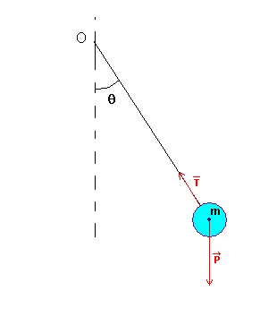

# Cour #2

## 1 Force
### 1.1 Definition
Notation : vecteur F
Unite : Newton

On appelle force toute action d'un corps sur un autre pouvant le deformer (resistance des materiaux) et/ou modifier son etat de mouvement

- ! `Si on a un corps rigide, l'absence de force signifie que su le corps est au repos il va rester et si il est en mouvement il le restera aussi `!

=> Sans effect exterieur un corps ne peut modifier son etat

### 1.2 Caracteristiques d'une force
- Grandeur (magnitude)
- Direction (Ligne d'action)
- Sens (Action)
- Point d'application

----[IMG_1.1]----------

La force est modeliser par vecteur 

## 2. Corps deformable et corps rigide
### 2.1 Corps deformable

Sur l'action d'une force le corps va se deformer

----[IMG_2.1]----------

### 2.2 Corps rigide
Sour l'action d'une force l'etat de mouvement du corps va etre modifier

- ! `Dans ce cours seuls les corps rigides seront etudier` !

## 3. Differents type de force
### 3.1 Forces fondamentales
Il existe 4 forces fondamentales dans la nature

- Gravite (Newton VS Einstein)
- Force electro-magnitique
- Interaction nucleaire faible et forte

----[IMG_3.1]----------

C = celerite de la lumiere
= 3 x 10^8 m/s
V son = 3 x !0^2 m/s

### 3.2 Classification des forces
On a 2 types de force
1. Force a distance
    - Poids
    - Notation : [Vecteur W] = m[Vecteur g]
    - Unite : [N] 
    - g = 9.81m/s^2  => Acceleration gravitationelle

Sens verticale vers le bas 
----[IMG_3.2-1]----------

2. Force de contacts
----[IMG_3.2-2]----------

## 4 Different mouvements
### 4.1 mouvement de translation

----[IMG_4.1-1]----------

Un corps est en mouvement de translation si tous les points de ce corps forments des courbes superposables

### 4.2 Mouvement de rotation

----[IMG_4.2-1]----------

Un corps est un mouvement de rotation si tous les points du corps se deplacent selon des cercles dont les centres sont situer sur une droite (axe de rotation) et AA' != BB' != CC'

## 5 Lois de Newton
Elle ont ete definies en 1687 dans les principes mathematique de la phylosophie de la nature

Elles permettent de represente analytiquement la realite

1. 1ere lois de Newton
- Si la resultante des forces agissant sur le corps est nulle alors celui-ci sera en equilibre

2. 2eme lois de Newton
principe fondamentale de la dynamique
- Si une s'exerce sur un corps alors celui-ci subit une acceleration proportionnelle a sa masse

Somme de [Vecteur Exterieur] = m x [Vecteur a]

3. 3eme lois de Newton
- Principe action/reaction

## 6 equilibre statique
### 6.1 definition
Un corps est dit en equilibre si la resultant de toutes les forces **exterieures** est nulle

[Vecteur R] = Somme de [Vecteur F exterieur] = [Vecteur 0]

Rx = Somme [Vecteur Fx] = 0
Ry = Somme [Vecteur Fy] = 0

